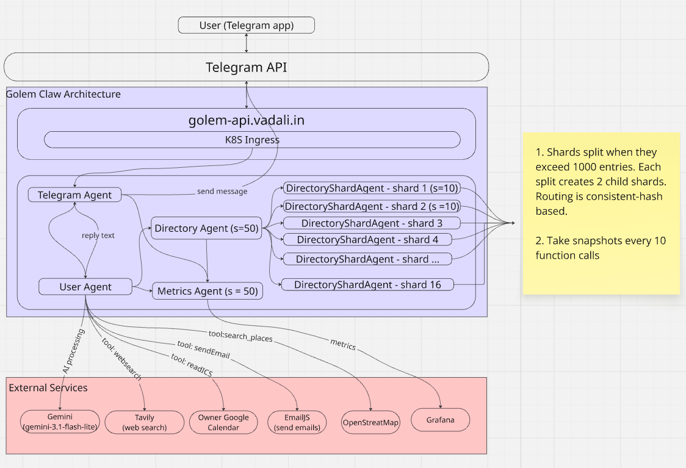

# Seeta AI Assistant — Telegram AI Assistant on Golem

A personal AI assistant delivered over Telegram, built on [Golem](https://golem.cloud) durable agents. Each user gets
their own persistent agent that remembers preferences, reads calendars, sends emails, books appointments, looks up
stocks and weather, and more — all surviving crashes and restarts without losing state.

**Telegram bot:** [@golemclaw_seeta_bot](https://t.me/golemclaw_seeta_bot)

**Live deployment:** `https://seeta-ai-assistant.apps.golem.cloud`

---

## Features

- **Conversational AI** powered by Google Gemini Flash with multi-turn memory
- **Calendar integration** — reads iCal feeds, shows today's events, checks slot availability
- **Appointment booking** — book slots on anyone's calendar; cross-user bookings send an iCal email to the owner
- **Email** — send emails by name via a shared directory (email addresses stay private)
- **Contact registry** — publish your display name and email so others can reach you by name
- **Weather** — current conditions via wttr.in
- **Web search** — Tavily-powered search for current events and factual queries
- **Stock prices** — historical OHLC data via Yahoo Finance
- **Wikipedia summaries**
- **Reminders** — set one-off reminders delivered via Telegram
- **Daily briefing** — scheduled morning summary of calendar, weather, and news
- **User preferences** — remembers timezone, city, name, and other personal settings

---

## Architecture



All agents are compiled to Scala.js → WASM (QuickJS runtime) and run on Golem's durable execution platform, meaning
state is persisted in an oplog (something like journal) and survives crashes automatically.

**Performance note:** The Golem agent architecture scales horizontally — each user has an independent durable agent
with no shared mutable state between users. The bottleneck at scale is Gemini API rate limits and latency, not the
Golem architecture itself.

### Directory sharding

The 16 fixed shards give an initial capacity of **16 × 1,000 = 16,000 users** before any splitting. When a shard
reaches 1,000 entries it splits into two children:

```
DirectoryShardAgent("shard-7")          # becomes an internal router, data cleared
  ├── DirectoryShardAgent("shard-7-0")  # entries 0–499
  └── DirectoryShardAgent("shard-7-1")  # entries 500–1,000
```

Each child can split recursively when it also hits 1,000 entries, so total capacity is unbounded.

---

## Prerequisites

| Tool                                                           | Version                                   |
|----------------------------------------------------------------|-------------------------------------------|
| [Golem CLI](https://github.com/golemcloud/golem-cli) (`golem`) | ≥ 1.5.0                                   |
| Java                                                           | 21                                        |
| sbt                                                            | 1.12+                                     |
| A Telegram bot token                                           | from [@BotFather](https://t.me/BotFather) |

---

## Tools

- [Tavily](https://app.tavily.com/home) web search (using my personal google sign-in)
- [wttr.in](https://wttr.in) weather 
- [EmailJS](https://www.emailjs.com/) email sending (using my personal google sign-in)
- [Google Gemini](https://ai.google.dev/gemini-api) AI model (using my personal google sign-in)
- [Yahoo Finance](https://finance.yahoo.com/) stock prices
- [Wikipedia](https://en.wikipedia.org/) summaries
- [Telegram](https://telegram.org/) messaging
- [iCal](https://en.wikipedia.org/wiki/ICalendar) calendar feeds (optional: Using my personal google calendar)
- [OpenStreetMap](https://www.openstreetmap.org/) geocoding

## Environment Variables

Give correct details in `.env` file which is located in the root directory of the project.


### EmailJS template

The template must accept these variables: `to_email`, `subject`, `message`.  
A minimal template body: `{{message}}`

---

## Local Setup

```bash
# 1. Clone and enter the project
git clone <repo-url> seeta-ai-assistant
cd seeta-ai-assistant

# 2. Create .env with the variables above

# 3. Start the Golem local server (in a separate terminal)
golem server start

# 4. Load env vars and deploy locally
export $(grep -v '^#' .env | xargs)
golem -L deploy --yes

# 5. Start the Telegram poller
golem -L agent invoke 'TelegramPollerAgent("main")' start

# 6. Verify
golem -L agent list
```

---

## Cloud Deployment

```bash
# 1. Authenticate with Golem Cloud (opens browser for GitHub OAuth2)
golem -C account get

# 2. Load env vars and deploy
export $(grep -v '^#' .env | xargs)
golem -C deploy --yes --update-agents auto

# 3. Start the Telegram poller
golem -C agent invoke 'TelegramPollerAgent("main")' start

# 4. Verify
golem -C agent list

# 5. Redeploy on changes
golem build && golem deploy -C --yes --update-agents auto && golem component -C list && golem agent -C list
golem deploy -e self-hosted --yes --update-agents auto

#6. One agent auto update did not work for me, (NOT WORKING)
golem -C agent update 'UserAgent("6794831517")' auto --await

# 7. Completely remove everything
export $(grep -v '^#' .env | xargs) && golem build && golem -C deploy --yes --redeploy-agents && golem -C agent invoke 'TelegramPollerAgent("main")' start
```

---

## Self-Hosting Golem: Issues and Solutions

### Why?

After submitting, I saw `John De Goes's` message announcing a 24-hour extension. I used that time to self-host Seeta AI Assistant
on my own infrastructure, partly because I am curious and partly because Golem Cloud was experiencing some instability
during the hackathon (understandable given the higher-than-expected participation or wrong estimate of the event).

### What I did?

Deployed Seeta AI Assistant on a self-hosted Golem instance running on a Kubernetes cluster, accessed via `golem.vadali.in`.

#### Steps

1. Found Golem's official Docker Compose example at
   `github.com/golemcloud/golem/tree/main/docker-examples/published-postgres`
2. Converted the 9-service `compose.yaml` into Kubernetes manifests (`k8s/` directory)
3. Deployed to an existing EKS cluster using the existing nginx ingress controller
4. Added a CNAME record in Route53: `golem.vadali.in` => existing ELB
5. Added `self-hosted` environment to `golem.yaml` and deployed Seeta AI Assistant

### Kubectl commands

#### Deploy to private Golem Cloud

1. Create all kubernetes resources except ingress:
2. Fill in the ingress values and apply 

```
kubectl apply -f k8s/00-namespace.yaml \
  -f k8s/01-configmap.yaml \
  -f k8s/02-pvc.yaml \
  -f k8s/03-postgres.yaml \
  -f k8s/04-redis.yaml \
  -f k8s/05-registry-service.yaml \
  -f k8s/06-shard-manager.yaml \
  -f k8s/07-compilation-service.yaml \
  -f k8s/08-worker-executor.yaml \
  -f k8s/09-worker-service.yaml \
  -f k8s/10-debugging-service.yaml \
  -f k8s/11-router.yaml
  
### Provide: your-ingress-class and your-domain
sed -e 's/YOUR_INGRESS_CLASS/<your-ingress-class>/g' -e 's/YOUR_DOMAIN/<your-domain>/g' k8s/12-ingress.yaml | kubectl apply -f -


kubectl scale deployment -n golem --replicas=0 \
    golem-component-compilation-service \
    golem-debugging-service \
    golem-registry-service \
    golem-router \
    golem-shard-manager \
    golem-worker-executor \
    golem-worker-service \
    redis
```

## Demo / Testing Script

The bot supports multiple independent users. Each gets their own persistent agent.

### User 1 — Owner

Open [@golemclaw_seeta_bot](https://t.me/golemclaw_seeta_bot) as the owner account and send these messages one by one:

```
Remember that I am Seeta, I live in Hilversum. My email address is "your@email.com"
```

> Bot stores name, city (auto-infers CET timezone), and registers email in the shared directory.

```
What is time now?
```

> Answers from injected current datetime — no tool call needed.

```
What is time in Hyderabad?
```

> Computes IST from current UTC — no web search, just offset arithmetic.

```
What is weather? If it is not wet I can go for a walk
```

> Calls weather tool with Hilversum (from stored city preference), gives a walk recommendation.

```
How is my calendar look like today?
```

> Fetches configured iCal feed and lists today's events.

```
Track ASML, MSFT, AMZN, HAL and NTPC stocks and brief everyday 3 times — start of the day, mid day and end of the day
```

> Fetches recent OHLC for each ticker; schedules three daily reminders via Telegram.

```
By the way what is WASM?
```

> Fetches Wikipedia summary.

```
Remind me everyday at 9 AM weather and top 5 news items
```

> Schedules a recurring daily briefing at 09:00 CET.

```
Register my email address is "your@email.com"
```

> Publishes display name "Seeta Ramayya" + email to the global directory so other users can reach Seeta by name.

---

### User 2 — Another user

Open the same bot from a **different Telegram account**:

```
Remember that I am Swetha, I live in Hilversum. My email address is srvadali@gmail.com
```

> Bot stores Swetha's profile in her own isolated agent.

```
Register my email address is srvadali@gmail.com
```

> Publishes "Swetha" + email to the global directory. (This is an example of shared memory)

```
Send an email to "Seeta Ramayya" about my discussion about the job offer, I like it but I want 10% increase. I love to learn scala with Data engineering experience it is useful. Make sure it is polite and professional
```

> Looks up Seeta Ramayya's email from the directory, sends a professionally worded email from Swetha's address. Seeta's
> actual address is never revealed to Swetha.

```
What is "Seeta Ramayya" email address?
```

> Bot refuses to reveal it — privacy is enforced by design.

```
Book an appointment with "Seeta Ramayya" at 16:00 CET today
```

> Bot routes the booking to Seeta's agent, checks her calendar for conflicts. If busy, reports unavailability.

```
What about 17:00 CET today?
```

> Checks the next slot.

```
Reason is to discuss about the job offer, duration is 30 mins
```

> Confirms the booking, stores it on Seeta's calendar, and sends Seeta an iCal email notification with a calendar invite
> from Swetha's address.

---

## Running Tests

```bash
sbt test
```

51 unit tests covering calendar parsing, email sending, web search, Telegram parsing, and user profile tools.

---

## Project Structure

```
src/main/scala/seeta_ai_assistant/
├── UserAgent.scala / UserAgentImpl.scala       # Per-user AI agent + tool dispatch
├── TelegramPollerAgent.scala / ...Impl.scala   # Long-poll Telegram loop
├── DirectoryAgent.scala / ...Impl.scala        # Global name/email registry
├── DirectoryShardAgent.scala / ...Impl.scala   # Sharded email storage
├── GeminiParser.scala                          # Gemini response parsing
├── TelegramParser.scala                        # Telegram update parsing
└── tools/
    ├── BookingTool.scala     # Appointment booking + iCal email notifications
    ├── CalendarTool.scala    # iCal feed parsing
    ├── ContactTool.scala     # publish_contact, send_email_to_person
    ├── DailyBriefingTool.scala
    ├── EmailTool.scala       # EmailJS integration
    ├── HttpTool.scala        # fetch wrapper
    ├── StockTool.scala       # Yahoo Finance OHLC
    ├── TelegramTool.scala    # Send Telegram messages
    ├── UserProfileTool.scala # Preferences
    ├── WeatherTool.scala     # wttr.in
    ├── WebSearchTool.scala   # Tavily
    └── WikipediaTool.scala
```
